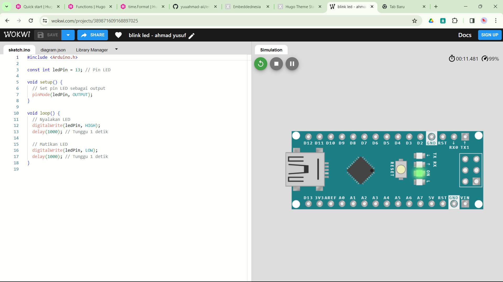

# Tujuan
tujuan tutorial kali ini adalah menyalakan led selama satu detik, kemudian mematikannya lagi selama satu detik.

# link wokwi
berikut adalah link wokwi yang saya sediakan [blink led - ahmad yusuf](https://wokwi.com/projects/389871609168897025)

# program
```c++
#include <Arduino.h>

const int ledPin = 13; // Pin LED

void setup() {
  // Set pin LED sebagai output
  pinMode(ledPin, OUTPUT);
}

void loop() {
  // Nyalakan LED
  digitalWrite(ledPin, HIGH);
  delay(1000); // Tunggu 1 detik

  // Matikan LED
  digitalWrite(ledPin, LOW);
  delay(1000); // Tunggu 1 detik
}
```
 
# gambar dokumentasi
